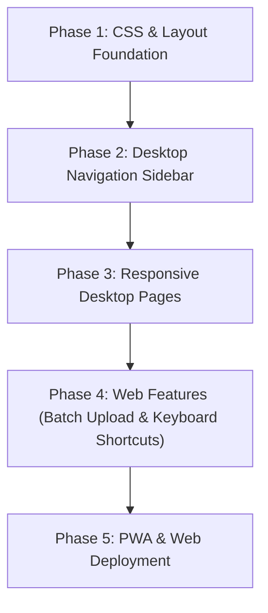

# Myser — Desktop Web Expansion & Responsive Architecture Plan

This document outlines the architecture, layout system, and step-by-step roadmap to transform **Myser** from a mobile-centered app into a **full-featured, responsive Desktop Web platform** while preserving its native iOS and Android mobile capabilities.

---

## 1. Vision & Strategy

Myser currently uses a fixed mobile layout (`max-width: 430px`) centered on desktop screens. To support upcoming web features and scale for desktop users:

* **Hybrid Responsive Design**: On mobile devices (`< 768px`), Myser remains a compact app with bottom navigation and mobile drawers. On desktop screens (`≥ 768px`), it expands into a **full-screen SaaS financial dashboard**.
* **Shared Logic, Adaptive Layouts**: All backend data logic (SQLite `sql.js`, Firebase sync, OCR pipeline, currency calculations) is 100% shared. Only the UI shell and layout containers change based on screen width.

---

## 2. Responsive Breakpoint & Navigation System

### Breakpoint Matrix

| Viewport Width | Device Target | Navigation Shell | Layout Container |
| :--- | :--- | :--- | :--- |
| **`< 768px`** | Mobile (iOS / Android / Mobile Web) | Bottom Navigation Bar + Mobile Drawer | Centered Mobile Container (`max-width: 430px`) |
| **`768px – 1023px`** | Tablets & Foldables | Collapsible Left Sidebar | Fluid Container (`max-width: 960px`) |
| **`≥ 1024px`** | Desktop & Laptop Web | Persistent Left Sidebar (260px) + Top Header | Full Desktop Dashboard (`max-width: 1440px`) |

---

## 3. Desktop Shell & Component Architecture

### A. Dynamic Layout System (`src/app/layout.tsx`)

Instead of locking `.app-container` to `430px`, layout containers expand dynamically:

```tsx
// Structure of responsive layout
<div className="desktop-layout-root">
  {/* Visible on screens >= 768px */}
  <DesktopSidebar className="hidden md:flex" />

  <div className="main-content-wrapper">
    <PageHeader />
    <main className="page-body">{children}</main>
  </div>

  {/* Visible on screens < 768px */}
  <BottomNav className="flex md:hidden" />
</div>
```

### B. Persistent Desktop Sidebar (`src/components/DesktopSidebar.tsx`)
A desktop-native sidebar replacing the mobile drawer on wide screens:
* **Brand Logo & Version**: Stylized Myser mark + badge.
* **Primary Navigation Links**: Dashboard, Add Expense, History, Analytics, Vault, Settings.
* **App Mode Switcher**: Quick toggle between *Budget Mode* and *Tracker Mode*.
* **Profile & Sync Status**: Cloud sync indicator, current user email, sign-out button.
* **Quick Log Button (`+ New Expense`)**: Opens quick-add modal from anywhere.

---

## 4. Page-by-Page Desktop Layout Transformations

### 1. Dashboard Page (`/dashboard`)
* **Mobile**: Single-column vertical scroll (Spend Card → Progress Ring → Recent Transactions).
* **Desktop Grid (3-Column Layout)**:
  - **Left (2 cols)**: Hero financial health card, budget progress bars, category breakdown grid.
  - **Right (1 col)**: Live recent transaction feed + pending OCR notifications panel + monthly pace widget.

### 2. Transaction History Page (`/history`)
* **Mobile**: Simple list with date section headers.
* **Desktop Spreadsheet View**:
  - Full-width interactive data table.
  - Search bar + multi-category filter dropdowns + date range picker inline at top.
  - Sortable columns (Date, Category, Merchant, Amount, Note).
  - Bulk actions bar (Select all → Export selection to CSV / Bulk delete).

### 3. Vault & Receipt Storage (`/vault`)
* **Mobile**: Grid of document cards → tap to open document modal.
* **Desktop Split Inspector Layout**:
  - **Left Pane (320px)**: List of uploaded receipts with search & date filters.
  - **Center Pane (Flex 1)**: Interactive document viewer (Zoom, Rotate, High-res PDF/Image preview).
  - **Right Pane (300px)**: Extracted OCR metadata, linked transaction details, and raw OCR text inspector.

### 4. Analytics & Reports (`/analytics`)
* **Mobile**: Stacked Recharts cards.
* **Desktop Command Center**:
  - 2x2 grid of responsive charts (Monthly Trend Line + Category Donut Chart + Daily Spend Histogram + Spending Comparison vs Last Month).
  - One-click **"Export Monthly PDF Statement"** button pinned to top header.

---

## 5. Upcoming Web-Exclusive Desktop Features

As Myser expands over the coming weeks, the desktop platform will gain web-exclusive superpowers:

1. **Batch Drag-and-Drop Receipt Upload**:
   - Drag 10+ receipt images/PDFs into a dropzone on the desktop Vault.
   - Batch OCR queue processes receipts in parallel with progress bars.

2. **Keyboard Shortcuts & Command Palette (`Cmd + K` / `Ctrl + K`)**:
   - `Cmd + K`: Open universal search & action bar.
   - `N`: Quick log new transaction.
   - `/`: Focus search input.
   - `Esc`: Close modals/inspectors.

3. **Spreadsheet Import / Export**:
   - Drag & drop `.csv` or `.xlsx` bank statements to import transactions.
   - Export custom date range data to CSV/Excel for accounting software (QuickBooks, Excel, Notion).

4. **Multi-Window Receipt Split Screen**:
   - Compare receipt scans side-by-side with bank statements.

5. **PWA (Progressive Web App) Desktop Installation**:
   - Web manifest and service worker so desktop users can install Myser as a standalone Mac/Windows desktop app.

---

## 6. CSS Refactoring Plan (`src/app/globals.css`)

### CSS Utility Adjustments
```css
/* Responsive container expansion */
.app-container {
  width: 100%;
  max-width: 430px; /* Default for mobile */
  margin: 0 auto;
  min-height: 100vh;
}

@media (min-width: 768px) {
  .app-container {
    max-width: 100%; /* Expand to full width on desktop */
    display: flex;
  }

  .page-content {
    padding-bottom: 24px; /* Remove mobile bottom nav offset */
    padding-left: 260px;  /* Offset for desktop left sidebar */
    width: 100%;
  }

  .bottom-nav {
    display: none !important; /* Hide mobile bottom bar on desktop */
  }
}
```

---

## 7. Execution Phasing & Milestones



* **Milestone 1**: Refactor `globals.css` container max-width and add media queries (`≥ 768px`).
* **Milestone 2**: Build `<DesktopSidebar />` and update root layout.
* **Milestone 3**: Refactor Dashboard, History, and Vault for multi-column desktop screens.
* **Milestone 4**: Implement Drag & Drop batch upload and CSV export.
